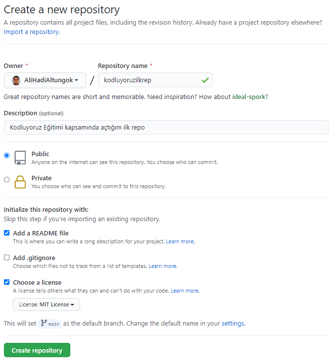

# Kodluyoruz İlk Repo

Bu repo [Kodluyoruz](https://www.kodluyoruz.org/) Front-End eğitiminde olışturduğumuz ilk repo. İçerisinde bir adet README dosyası, bir adet de index.html dosyası barındırıyor.




## Installation

Öncelikle projeyi clonelayın.

```

git clone https://github.com/AliHadiAltungok/kodluyoruzilkrepo.git

```
## Usage

Projeyi cloneladıktan sonra Visual Studio Code programını açınız.

Linux için:
```

cd kodluyoruzilkrepo
code .

```
## Contributing

Pull requestler kabu edilir. Büyük değişiklikler için lütfen önce neyi değiştirmek istediğinizi tartışmak için bir konu açınız.

## Lisence
[MIT]()

